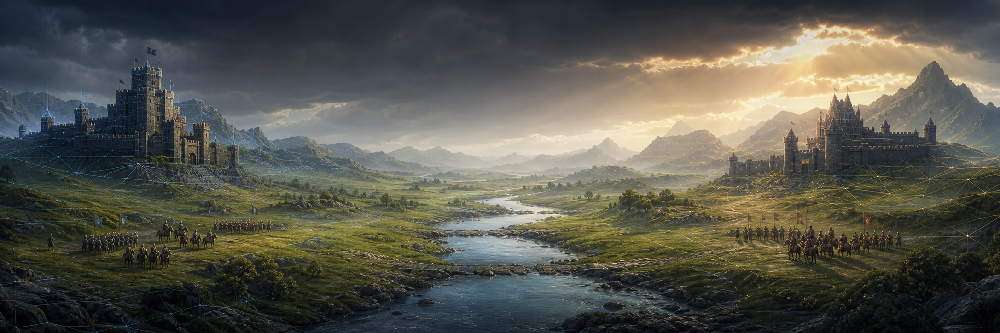

<p align="center">
  
</p>

<h1 align="center">OpenBFME Engine</h1>

<p align="center">
  An experimental open-source Godot RTS project targeting BFME2 skirmish play,<br>
  powered by content converted locally from a game installation you own.
</p>

<p align="center">
  
  
  
  
</p>

> [!IMPORTANT]
> OpenBFME is an experimental engine project, not a finished game or a download
> of BFME2. It does not distribute EA's game assets. The compatibility workflow
> requires a lawfully acquired BFME2 1.06 installation and converts content
> locally on your computer.

> [!NOTE]
> OpenBFME is an early development project. Expect unfinished features, bugs,
> and breaking changes.

## What is OpenBFME?

OpenBFME is rebuilding the skirmish side of *The Battle for Middle-earth II* in
Godot. The project has three goals:

1. Reproduce BFME2 skirmish behavior and presentation through measured
   comparison with the original game.
2. Replace the aging proprietary runtime with an understandable, deterministic,
   self-hostable modern engine.
3. Give RTS developers and BFME modders a practical base for new factions, maps,
   scenarios, presentation packs, and total conversions.

The importer understands BFME2's source formats; the game runtime loads a
versioned pack generated privately on the user's machine. Proprietary retail
content stays outside Git and outside public releases.

## Current state

OpenBFME can import BFME2 data and run an early skirmish experience in Godot.
Men versus Men on Fords of Isen II is the most complete part of the project.
Other factions and maps are under active development and are not yet ready for
normal play.

| Feature | Status |
|---|---|
| BFME2 1.06 importer | Completed |
| Local private content packs | Completed |
| Main menu and skirmish setup | In progress |
| Men versus Men on Fords of Isen II | In progress |
| All six BFME2 factions | In progress |
| Five-map development set | In progress |
| Multiplayer and dedicated servers | Not started |
| Public installer | Not started |

Campaigns, War of the Ring, and Rise of the Witch-king are not in the current
project scope. See [STATUS.md](STATUS.md) for known problems and test results.

## Why this project exists

This began as a joke and an AI benchmark: could frontier models turn the raw
pieces of BFME into something usable in Godot? After a few hours of human
direction and a few days of AI-assisted coding, the project owner recalls having
a surprisingly playable prototype. That personal timeline is part of the
project's origin story, not a reproducible benchmark result.

The larger motivation is the community. BFME modders have spent years doing
remarkable work within the limits of an old proprietary engine. OpenBFME aims to
give those developers a modern starting point without redistributing the
original game.

## How it works

```text
Lawfully owned BFME2 1.06 installation
              |
              v
  Python importer + pinned converters
              |
              v
  Private, local, versioned runtime pack
              |
              +--> deterministic authoritative simulation
              |
              +--> Godot rendering, input, UI, and audio
```

- `importer/` discovers, extracts, converts, validates, and records provenance.
- `game/` contains the Godot client and current playable runtime.
- `engine/` contains the path toward a pure deterministic simulation layer.
- `contracts/` contains machine-readable product and modding policies.
- `.private/` contains local retail inputs and converted output and is never a
  public-release input.

Strict private compatibility paths are designed to fail when required retail
evidence is missing. Focused tests enforce that rule on covered paths; complete
repository-wide fallback auditing remains release work.

## Try the development build

The current workflow is Windows-first and intended for developers. You need a
lawfully acquired BFME2 1.06 installation, Godot 4.7, Python 3.12, and the .NET
SDK selected by `global.json`.

```bat
set OPENBFME_GODOT=C:\Tools\Godot\Godot_v4.7-stable_win64.exe
run_doctor.bat
run_importer.bat "D:\Games\BFME2"
run_retail_slice.bat
```

Use your actual Godot and BFME2 paths. Read the full
[getting-started guide](docs/GETTING_STARTED.md) before importing.

## Roadmap

| Goal | Status |
|---|---|
| Import BFME2 1.06 content locally | Completed |
| Finish Men versus Men on Fords of Isen II | In progress |
| Finish the Men faction across the selected maps | In progress |
| Finish all six BFME2 factions and skirmish systems | In progress |
| Add self-hosted multiplayer for up to eight players | Not started |
| Add replays, observers, Create-a-Hero, and broader modding tools | Not started |
| Package a polished public installer | Not started |

Campaign material and War of the Ring are not planned. More detail is available
in [DIRECTION.md](DIRECTION.md).

## Find your way around

| If you want to... | Start here |
|---|---|
| Understand the project in five minutes | [Documentation hub](docs/README.md) |
| Install and run the developer build | [Getting started](docs/GETTING_STARTED.md) |
| Check current passes and failures | [Status](STATUS.md) |
| Understand the engine boundaries | [Architecture](docs/ARCHITECTURE.md) |
| Learn how retail conversion stays private | [Content pipeline](docs/CONTENT_PIPELINE.md) |
| Understand the parity standard | [BFME2 parity](docs/BFME2_PARITY.md) |
| Read the modding direction | [Modding](docs/MODDING.md) |
| Contribute safely | [Contributing](CONTRIBUTING.md) |
| Understand the use of AI | [AI development](docs/AI_DEVELOPMENT.md) |
| Ask a common question | [FAQ](docs/FAQ.md) |

## AI-assisted development

OpenBFME has been built with extensive AI assistance under human direction and
testing. Fable 5, ChatGPT Sol, and Kimi K3 have all contributed to the project.
AI-generated work is reviewed and tested like any other contribution. See
[docs/AI_DEVELOPMENT.md](docs/AI_DEVELOPMENT.md).

## Contributing

The repository is being prepared for wider collaboration. Good contributions are
narrow, reproducible, and tied either to observed BFME2 behavior or a documented
modern-engine contract.

Do not submit retail assets, converted content, game packs, original-game
captures, secrets, personal configuration, or agent instruction files. Start
with [CONTRIBUTING.md](CONTRIBUTING.md).

## License and legal notice

OpenBFME source is distributed under the GNU General Public License v3.0. The
repository carries its own [LICENSE](LICENSE). That license applies
to code the project is authorized to license, not to *The Lord of the Rings*,
BFME2, or third-party content. Third-party provenance and notice review remains a
publication gate.

OpenBFME is an unofficial fan project. It is not affiliated with, endorsed by,
or sponsored by Electronic Arts, Middle-earth Enterprises, the Tolkien Estate,
Embracer Group, or their licensors. Related names, trademarks, characters, and
original game assets belong to their respective owners.

Users must supply their own lawfully acquired copy of BFME2. Retail and converted
retail assets must never be committed, uploaded, bundled, or redistributed with
this project.
